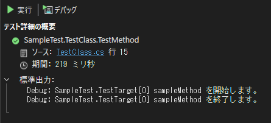

# Maris.Logging.Testing

[`Microsoft.Extensions.Logging.ILogger`][ILogger Web] または [`Microsoft.Extensions.Logging.ILogger<TCategoryName>`][ILogger-T Web] の xUnit テストで利用可能なロガーを提供します。
このロガーを使用すると、テスト対象クラスで出力したログを、 Visual Studio のテストエクスプローラー上で確認できるようになります。
また [`Microsoft.Extensions.Logging.Testing.FakeLogger`][FakeLogger Web] と連携して、テストコード内でログ出力内容を検証する機能を提供します。

## インストール方法

パッケージマネージャーコンソールまたはコマンドプロンプトで以下のコマンドを実行してインストールしてください。

- パッケージマネージャーコンソール

```winbatch
Install-Package Maris.Logging.Testing
```

- コマンドプロンプト

```bash
dotnet add package Maris.Logging.Testing
```

## 使用方法

[TestLoggerManager](src\Maris.Logging.Testing\Xunit\TestLoggerManager.cs) は xUnit のテストコードで利用できる ILogger の具象クラス ([XunitLogger](src\Maris.Logging.Testing\Xunit\XunitLogger.cs)) と [FakeLogger](https://learn.microsoft.com/ja-jp/dotnet/api/microsoft.extensions.logging.testing.fakelogger) のインスタンスを生成します。
xUnit のテストコードで以下のように使用します。

```csharp title="TestClass1.cs"
using Maris.Logging.Testing.Xunit;
using Xunit;

namespace Maris.Tests;

public class TestClass1
{
    private readonly TestLoggerManager loggerManager;

    public TestClass1(ITestOutputHelper testOutputHelper)
        => this.loggerManager = new TestLoggerManager(testOutputHelper);

    [Fact]
    public void TestMethod()
    {
        // ILogger<T> のオブジェクトを生成可能。
        var logger = this.loggerManager.CreateLogger<TestTarget>();
        var target = new TestTarget(logger);

        // Do something...

        // TestLoggerManagerのLogCollectorプロパティはFakeLogger.Collectorを公開します
        Assert.Equal(1, this.loggerManager.LogCollector.Count);  
        Assert.Equal("expectedCategory", this.loggerManager.LogCollector.LatestRecord.Category);
        Assert.Equal("expectedMessage", this.loggerManager.LogCollector.LatestRecord.Message);
    }
}
```

[IHost](https://learn.microsoft.com/ja-jp/dotnet/api/microsoft.extensions.hosting.ihost) のテストを行う際は、 [TestLoggerServiceCollectionExtensions](src\Maris.Logging.Testing\Xunit\TestLoggerServiceCollectionExtensions.cs) の `AddTestLogging` メソッドを利用して各 Logger を DI コンテナーに登録できます。
xUnit のテストコードで以下のように使用します。

```csharp title="TestClass2.cs"
using Microsoft.Extensions.DependencyInjection;
using Microsoft.Extensions.Hosting;
using Maris.Logging.Testing.Xunit;
using Xunit;

namespace Maris.Tests;

public class TestClass2
{
    private readonly TestLoggerManager loggerManager;

    public TestClass2(ITestOutputHelper testOutputHelper)
        => this.loggerManager = new TestLoggerManager(testOutputHelper);

    [Fact]
    public async Task TestMethod()
    {
        using var app = this.CreateHost();
        var cancellationToken = TestContext.Current.CancellationToken;
        await app.RunAsync(cancellationToken);
        
        // Do something...
    }

    private IHost CreateHost()
    {
        var builder = Host.CreateDefaultBuilder();
        builder.ConfigureServices((context, services) =>
        {
            // テスト用の Logger を登録
            services.AddTestLogging(this.loggerManager);

            // Do something...            
        });

        return builder.Build();
    }
}
```

テストエクスプローラーではテスト実行中に出力されたログが以下のように表示されます。



## 主な依存ライブラリ

- [xunit.v3.extensibility.core](https://www.nuget.org/packages/xunit.v3.extensibility.core/)

  xUnit v3 の拡張機能を開発するためのパッケージです。
  このライブラリは xUnit v3 で開発されたテストプロジェクトでのみ利用できます。

- [Microsoft.Extensions.Diagnostics.Testing](https://www.nuget.org/packages/Microsoft.Extensions.Diagnostics.Testing)

  ログ出力のテストを行うためのライブラリです。

[ILogger Web]:https://learn.microsoft.com/ja-jp/dotnet/api/microsoft.extensions.logging.ilogger
[ILogger-T Web]:https://learn.microsoft.com/ja-jp/dotnet/api/microsoft.extensions.logging.ilogger-1
[FakeLogger Web]:https://learn.microsoft.com/ja-jp/dotnet/api/microsoft.extensions.logging.testing.fakelogger
